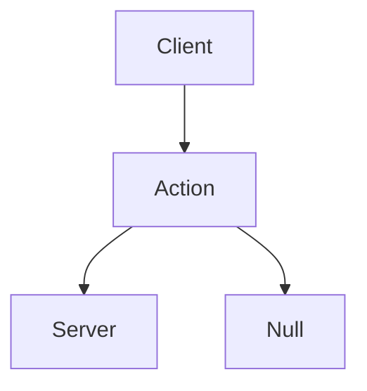

# Play

## Goal: 

* Connect single client to server
* Deal with dropped messages
* Have tight feedback loop to the client - server is behind the client
* The client drops a message - inconsistency between the state on the client and server
* input is too old - drop it.
* client will need to change the simulation so it's better aligned with the server.
* support multiple objects
* add robot objects
* connect multiple clients to a single server
* connect multiple clients to multiple connected servers
* each server will own a chunk of the space
* 

2 messages types
Ephemeral message - 
1 2 3 - dropped
2 3 4 -  
we're ok dropping any of these messages
updateNumber
How do we know the server dropped a message- 
we approx when the message should have arrived - in the past
we run all the operations that should have run since that state.
use the output to change the state that the client experience. 

#### syncing process 
client starts - sync with server - connection and sync
    connect 2
    server gets connect 1008
    client get's ok at 14 current time is 1008 - can assume that the server is (14-2)/2 + 1008, 
    client needs to be .5 ping in the future so that when a server receives a message it makes sense.
update - 
    send a message - assume when the message will be received by the server
    state - including the history 6 cycles behind - for the client 12 cycles behind

modules
send message in the network - network module
send the same message multiple times - ignore messages we've already received - or if they are too old.

How do ephemeral messages work
{
    // usefull for ping calculation
    "cycle": 2
    "data": {...},
}

Resend action data - action layer should know not to use a action that has already arrived - is handled at a different layer.

we've connected, we've calculated ping, we synced the server client
syncing means that the client and the server at approx the same cycle, 
c1 .5 ping in future
s at correct time
c2 (from c1 perspective) is 1 ping in the past

### ideal
p  c s  c msg    s msg
05 0 0 (c 10 0) (s 05 0)
10 1 0 (c 15 1) (s 10 0)
15 0 1 (c 20 1) (s 15 1)
20 1 1 (c 25 0) (s 20 1)

c 1 send m1 remember I sent m1 at 1. 
c 2 send m2
c 3 send m3
s 5 gets m1

c 8 gets m1 s t 5 pos

### non ideal 
ping is not 5 every time
// TODO: 
every update we send message with cycle, and data can be null

TODO: 
main point client is going to think of itself in the future.
So that when the server learns of his action it's going to happen at the right time
client still simulates the future now

retried
send message, wait for confirmation, no confirmation we retry.
send messages, over and over again, no confirmation we continue sending message.

TODO: 

[] after connection client change velocity and guesses the object position
[] server accepts the new velocity
[] client predicts the objects new position.

edge cases

client moving velocity or distance> sends information to server > 1/10 gets dropped.
server is aware of 9/10 movements, client is aware 10/10

expectations: 
c: > > > > > > d > > > x
s: > > > > > > > > x

Velocity - velocity of the object - ignore this implementation because there are more use cases for the ConstantVelocity.

ConstantVelocity - which doesn't change - or performs a single operation. make sure that client sends velocity multiple times with the same server cycle.

list of the last x changes the client made, and which server cycle they made them
send the entire list for y number of times.

server needs to be able to store the history - a way to compensate for lag.

sc - server cycle
v - velocity
p - position

client
sc v  p 
1  1  0 - client performed change in velocity after the update
2  1  0+1 - change in velocity at sc 
3  1  2
4  1  3
5  1  4
6  1  5

server
sc  v p
1   0 0
2   1 0
3   1 1 - server sends the p at sc

3,1 - position update of the server

reconcile
client
sc  v  p
1   1  0 - client performed change in velocity after the update
2   1  0+1 - change in velocity at sc 
3   1  1+1 - reconcile so that 

client updates to server
sc,v - multiples 

server updates to client
sc,p - most recent position

// when client message a2 is dropped
// by the time the server is aware of it, and alerts 
// the client, it's too late to send it again
// and simulate it on the server
client a1-1  a2-5 a3-10 ... a10
server a1-1  a3-10 ... a10

// we need to skip 5 message - from message a6 to a10
// to not receive message a6 when we send a11. 
a1 a2 a3 a4 a5| a6 |a7 a8 a9 a10 a11|

c s cl
1 0 0
2 0 1
3 0
3 1 1

client delay which causes changes to arrive in the past on the server - 

Implement wait on the client that equals .5 ping, reduce the inconsistency by half. lower the percived reaction of the user to their inputs.

The client sends an action
the client is ping aware - knows approx time to take the action - (about the time the server takes the action)
The client receives the exact time the server took the action and is able to 

94 server sends no position data
90 client sends an action
-----------------------
98 server receives it
94 client can perform the action
-----------------------
95 client receives 0 message that resets position.

### user experience degrades
client ignores its action
server receives the actions and confirms when it received them
the client acts on historic information and is behind the server.
user experience degrades because the client waits for approval from the server before it performs an action
best case half the time it takes for the response message to arrive.

### 
client sends messages 1,2,3,4
message 5 is dropped
client sends messages 6,7,8,9

The server can recognize that it didn't receive that message. 

Solution for this is to drop old messages

Problem: 
messages can be dropped, when they do the client simulation is out of sync with the server.
Solution 1: 
make sure the client knows it dropped data - could always happen and we need a way to recover from this.
Solution 2: 
Accept we dropped a message, create some type of way to recover - reconnect?

Example:
cli sc4    move 1 left M!
ser dropped the message
cli receives sc1 - 0 - runs simulation with M1
cli receives sc2 - 0 - runs simulation with M1
cli receives sc3 - 0 - runs simulation with M1
cli receives sc4 - 0 - runs simulation with M1
cli receives sc5 - 0 - the server didn't receive the input
runs simulation starting at sc5 without the input

current cycle 20
last cycle server received 10
ping 10
next cycle correction when current cycle is 20+ping +offset 2 = 32

